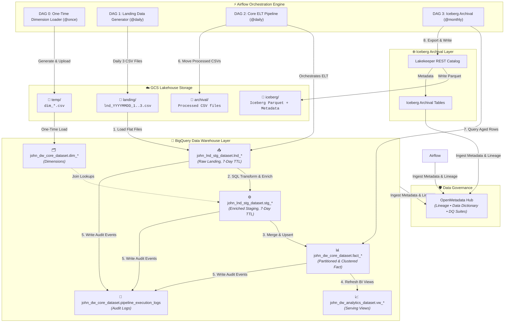

# Agency Banking & Mobile Money Lakehouse Data Pipeline - Project Plan

> [!IMPORTANT]
> **Project Goal**: Build a governed, end-to-end Lakehouse pipeline using Apache Airflow, Google Cloud Storage (GCS), BigQuery, Apache Iceberg, and OpenMetadata based on [`Project-Guide.md`](file:///c:/Users/ICT/Documents/3mttc3deprojects/docs/Project-Guide.md).

---

## 1. Project Overview & Architecture

### Business Problem Statement
This project simulates an agency banking and mobile money platform coordinating a nationwide network of POS agents processing financial transactions for underbanked populations. The fintech organization faces challenges with daily liquidity tracking, agent commission settlement accuracy, network performance monitoring, and compliance auditing.

The Lakehouse pipeline ingests raw transactional flat files, performs ELT transformations in BigQuery, exposes serving data marts to business intelligence tools, logs execution audits, offloads aged data to open-format Apache Iceberg tables, and maintains end-to-end governance via OpenMetadata.

### End-to-End Lakehouse Architecture

---

## 2. Configuration Parameters

| Parameter | Value | Description |
| :--- | :--- | :--- |
| **GCP Project ID** | `your-gcp-project-id` | Target Google Cloud Project |
| **GCS Bucket** | `gs://3mtt-lakehouse-agencybanking/` | Primary Lakehouse Storage Bucket |
| **BigQuery Dataset (Landing/Staging)**| `john_lnd_stg_dataset` (7-day TTL) | Temporary ingestion & staging dataset |
| **BigQuery Dataset (Core Fact/Dims)**| `john_dw_core_dataset` | Permanent warehouse storage |
| **BigQuery Dataset (Serving Views)** | `john_dw_analytics_dataset` | Business intelligence layer views |
| **Audit Log Table** | `john_dw_core_dataset.pipeline_execution_logs` | Central execution tracking log |
| **Iceberg Catalog** | Lakekeeper REST Catalog | Archival catalog manager |
| **Governance Platform** | OpenMetadata Instance | Lineage, data dictionary & DQ monitor |

---

## 3. Data Model & Schemas

### Dimension Tables (`john_dw_core_dataset`)

1. **`dim_agents`**:
   - `agent_id` (INT64, PK), `agent_name` (STRING), `business_name` (STRING), `terminal_id` (STRING), `tier_level` (STRING), `signup_date` (DATE)
2. **`dim_customers`**:
   - `customer_id` (INT64, PK), `customer_phone` (STRING), `kyc_status` (STRING), `account_type` (STRING), `registration_date` (DATE)
3. **`dim_transaction_types`**:
   - `txn_type_id` (INT64, PK), `txn_name` (STRING), `direction` (STRING), `is_financial` (BOOLEAN)
4. **`dim_geography`**:
   - `geo_id` (INT64, PK), `location_cluster` (STRING), `lga` (STRING), `state` (STRING), `region` (STRING)

### Landing Table (`john_lnd_stg_dataset.lnd_daily_transactions`)
- Raw ingestion table populated directly from GCS flat files (`lnd_YYYYMMDD_1..3.csv`).
- Schema: `txnid` (STRING), `createdat` (STRING), `terminalid` (STRING), `custphone` (STRING), `txntypecode` (INT64), `amount` (NUMERIC), `fee_charged` (NUMERIC), `status` (STRING)

### Staging Table (`john_lnd_stg_dataset.stg_daily_transactions`)
- Created via `CREATE OR REPLACE TABLE` in SQL during DAG 2 ELT execution.
- Performs dimension lookups, string parsing, timestamp conversion, and calculates `agent_commission` (`fee_charged * 0.70`).

### Partitioned Fact Table (`john_dw_core_dataset.fact_daily_transactions`)
- Partitioned by `DATE(transaction_timestamp)` and clustered by `agent_id`, `state`.
- Schema: `transaction_id` (STRING), `transaction_timestamp` (TIMESTAMP), `agent_id` (INT64), `agent_name` (STRING), `terminal_id` (STRING), `location_cluster` (STRING), `lga` (STRING), `state` (STRING), `customer_phone` (STRING), `kyc_status` (STRING), `txn_type_id` (INT64), `transaction_name` (STRING), `direction` (STRING), `transaction_amount` (NUMERIC), `fee_charged` (NUMERIC), `agent_commission` (NUMERIC)

### Serving Views (`john_dw_analytics_dataset`)
1. **`vw_agent_performance`**: Summarizes total transactions, transaction volume, gross fees, and agent commission earnings by agent tier and cluster.
2. **`vw_daily_liquidity_summary`**: Analyzes cash deposit (`IN`) vs cash withdrawal (`OUT`) volumes by LGA/state for daily cash rebalancing.
3. **`vw_kyc_compliance_risk`**: Flags high-value transactions conducted by `UNREGISTERED` or `PENDING` KYC accounts.

---

## 4. Pipeline Execution Workflow

### DAG 0: One-Time Dimension Loader (`@once`)
- Generates static/seed dimension CSVs (`dim_agents`, `dim_customers`, `dim_transaction_types`, `dim_geography`).
- Uploads CSVs to `gs://.../temp/`.
- Executes one-time load into BigQuery `john_dw_core_dataset.dim_*` tables.

### DAG 1: Daily Landing Data Generator (`@daily`)
- Simulates daily POS operational logs.
- Outputs exactly 3 deterministic CSV files per daily logical date: `landing/lnd_YYYYMMDD_1.csv`, `landing/lnd_YYYYMMDD_2.csv`, `landing/lnd_YYYYMMDD_3.csv`.
- Guarantees idempotency (re-running overwrites exact 3 files).

### DAG 2: Core ELT Pipeline (`@daily`)
- **Step 1: Direct Load**: Reads GCS `landing/` CSVs for `logical_date` into BigQuery `john_lnd_stg_dataset.lnd_daily_transactions`.
- **Step 2: SQL Staging Transform**: Runs `CREATE OR REPLACE TABLE stg_daily_transactions` joining raw landing records with dimension tables, cleaning data, and deriving `agent_commission`.
- **Step 3: Fact Upsert/Merge**: Runs SQL `MERGE` into partitioned `john_dw_core_dataset.fact_daily_transactions`.
- **Step 4: Audit Metrics Logging**: Appends task execution row to `john_dw_core_dataset.pipeline_execution_logs`.
- **Step 5: Refresh Serving Views**: Refreshes views in `john_dw_analytics_dataset`.
- **Step 6: File Hygiene & Archival**: Moves ingested flat files from `landing/` to `archival/` in GCS.

### DAG 3: Iceberg Archival Pipeline (`@monthly`)
- Queries fact table records older than retention period ($N$ months).
- Overwrites target monthly Apache Iceberg partitions in GCS `iceberg/` via Lakekeeper REST Catalog.

---

## 5. Audit Logging Specification

Every pipeline execution task appends audit events to `john_dw_core_dataset.pipeline_execution_logs`:

| Column Name | Data Type | Description |
| :--- | :--- | :--- |
| `run_id` | `STRING` | Airflow DAG run execution ID |
| `logical_date` | `DATE` | Pipeline logical date timestamp |
| `task_id` | `STRING` | Name of the executed Airflow task |
| `target_table` | `STRING` | Target dataset/table updated |
| `rows_processed` | `INT64` | Number of inserted / modified rows |
| `execution_status` | `STRING` | `SUCCESS` \| `FAILED` \| `RETRY` |
| `created_at` | `TIMESTAMP` | Logging event timestamp |

---

## 6. Data Governance with OpenMetadata

- **Visual Lineage**: GCS Flat Files -> Airflow DAG Tasks -> BQ Landing/Staging/Fact -> Serving Views & Iceberg Archives.
- **Unified Catalog**: Tagged schemas, column descriptions, and metadata across BigQuery and Iceberg open formats.
- **Data Quality Suites**: Automated DQ tests checking null constraints, primary key uniqueness, and value range assertions.
