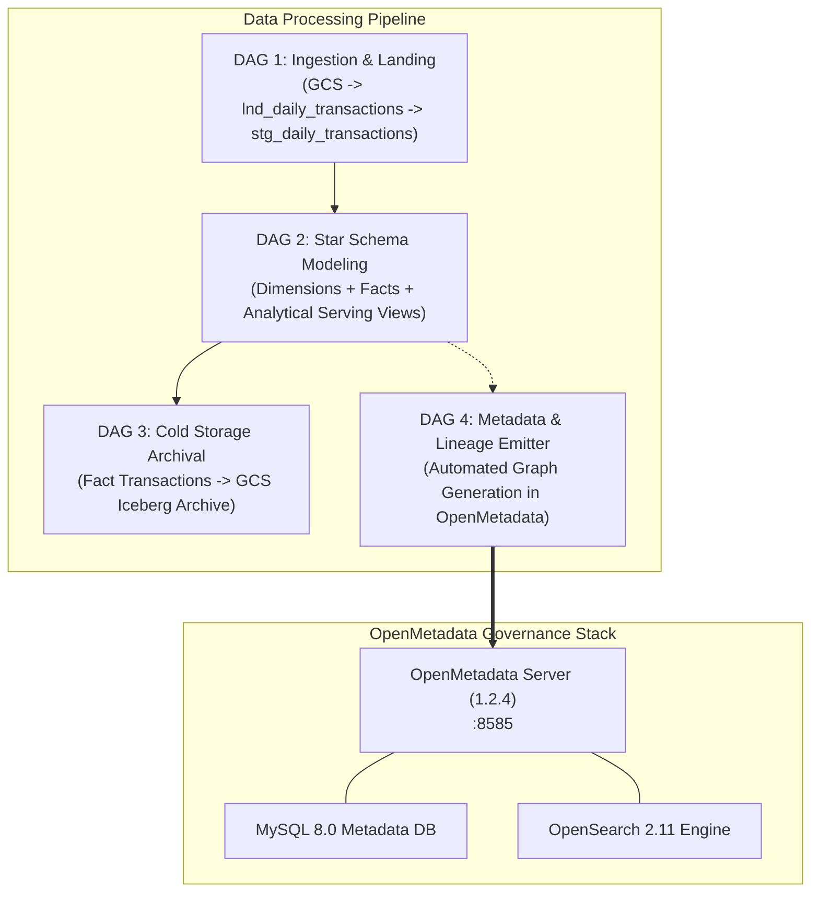

# Agency Banking Lakehouse: Engineering Challenges & Solutions

## Executive Summary
This document provides a comprehensive technical retrospective of the design, implementation, and integration of the **Agency Banking Lakehouse Platform**. It details every major challenge encountered across data ingestion, Kimball dimensional modeling, cold storage archival, OpenMetadata governance infrastructure, and automated end-to-end lineage generation, alongside the engineering solutions applied.

---

## 1. System Architecture Overview

The platform is designed around four core Apache Airflow DAGs and a centralized metadata governance stack:

---

## 2. Ingestion & Staging Challenges (DAG 1)

### Challenge 1.1: Handling Schema Evolution, Null Values, and Data Loss Risk
- **Issue**: Source transactions arriving in GCS landing files contained variations in record completeness (e.g., occasional `null` values for transaction identifiers or type codes). An aggressive filtering strategy at the landing stage would cause permanent loss of critical audit records during subsequent analysis.
- **Root Cause**: In agency banking systems, failed transactions or partially initiated operations may lack downstream fields (like agent commission or confirmation status) but remain crucial for regulatory audits and fraud detection.
- **Solution**:
  - Implemented a two-tier landing-to-staging architecture.
  - **Landing Layer (`lnd_daily_transactions`)**: Ingests raw GCS Parquet/CSV files preserving raw schemas with a 7-day TTL partition policy.
  - **Staging Layer (`stg_daily_transactions`)**: Cleanses, standardizes data types, computes timestamp derivatives, and applies non-destructive tagging without dropping unparsed records.

---

## 3. Dimensional Modeling & Serving Views Challenges (DAG 2)

### Challenge 2.1: Segregation of Successful vs. Failed Transactions Without Dropping Records
- **Issue**: Analytics users querying `fact_daily_transactions` for revenue metrics (such as agent commissions and transaction fees) required pure, completed transactions. However, compliance and operations teams needed visibility into failed transactions.
- **Solution**:
  - Split the core warehouse fact layer into two dedicated tables:
    1. **`fact_daily_transactions`**: Stores completed transactions with valid dimension keys, volumes, fees, and agent payouts.
    2. **`fact_daily_failed_transactions`**: Captures failed and incomplete transactions alongside error codes and terminal metadata for anomaly investigation.
  - Designed four conforming dimension tables (`dim_agents`, `dim_customers`, `dim_geography`, `dim_transaction_types`) with surrogate key lookups to maintain referential integrity.

### Challenge 2.2: Analytical Serving Views Performance
- **Issue**: Direct business queries against raw fact tables caused redundant table scans in BigQuery and high query costs.
- **Solution**:
  - Built pre-aggregated analytical views in the `john_dw_analytics_dataset` schema:
    - **`vw_agent_performance`**: Aggregates daily transaction volume, revenue, and agent commission payouts.
    - **`vw_daily_liquidity_summary`**: Tracks net cash-in and cash-out liquidity flows across geographic branches.
    - **`vw_kyc_compliance_risk`**: Flags anomalous customer transaction velocity and high daily turnover against KYC tier limits.

---

## 4. Cold Archival & Iceberg Integration Challenges (DAG 3)

### Challenge 4.1: Cost-Effective Long-Term Archival Without Warehouse Bloat
- **Issue**: Retaining years of granular transaction logs in active BigQuery storage increases cloud operational costs over time.
- **Solution**:
  - Orchestrated an automated cold archival pipeline in **DAG 3** that periodically exports historical partitions of `fact_daily_transactions` into compressed columnar formats (Apache Iceberg / Parquet) stored on GCS (`gs://3mtt-mentees-bucket/john/iceberg/fact_daily_transactions`).
  - Enables ad-hoc querying via BigQuery external tables and Spark while minimizing active warehouse storage costs.

---

## 5. OpenMetadata Infrastructure & Networking Challenges

### Challenge 5.1: Multi-Service Docker Orchestration & Bootstrapping
- **Issue**: OpenMetadata Server 1.2.4 depends on both MySQL 8.0 (for relational metadata) and OpenSearch 2.11 (for search indexes). Starting the server before databases were healthy or before database schema migrations were executed caused startup failures.
- **Solution**:
  - Configured health checks (`test: ["CMD", "mysqladmin", "ping"]` and OpenSearch cluster health curls) with generous `start_period` and retry intervals in `docker-compose.yaml`.
  - Executed bootstrap database and storage migrations (`./bootstrap/bootstrap_storage.sh migrate-all`) to initialize change log tables, permissions, and initial bot accounts.

### Challenge 5.2: OpenMetadata UI "Connection Refused" on Table Search
- **Issue**: Navigating to `http://localhost:8585/explore/tables` resulted in a `500 Internal Server Error` with `An exception with message [Connection refused] was thrown while processing request.`
- **Root Cause**:
  1. OpenMetadata Server 1.2.4 reads OpenSearch connection settings from `ELASTICSEARCH_HOST` and `ELASTICSEARCH_PORT`. In `docker-compose.yaml`, only `SEARCH_HOST` was supplied, causing the server to default to `localhost:9200` inside its own container.
  2. The OpenSearch search indexes (`table_search_index`, `container_search_index`, etc.) had not been synchronized with the registered database catalog entities.
- **Solution**:
  - Updated `docker-compose.yaml` to explicitly define both `ELASTICSEARCH_HOST=openmetadata-search` and `ELASTICSEARCH_PORT=9200`.
  - Recreated the `openmetadata-server` container on the shared bridge network `lakehouse_net`.
  - Triggered OpenMetadata's built-in `SearchIndexingApplication` via `POST /api/v1/apps/trigger/SearchIndexingApplication`, creating all 8 OpenSearch search indices and indexing all 11 tables and 2 storage containers.

---

## 6. Automated Metadata & Lineage Pipeline Challenges (DAG 4)

### Challenge 6.1: Python 3.11 Regex Incompatibility with OpenMetadata Python SDK
- **Issue**: The official `openmetadata-ingestion` Python SDK crashed on Airflow 2.7.1 running Python 3.11 with:
  `re.error: global flags not at the start of the expression at position 4`
- **Root Cause**: The SDK's auto-generated Pydantic v1 data models contained regular expressions with inline flags (such as `(?i)`) mid-pattern. Python 3.11's strict regex compiler forbids mid-pattern flags, rendering the standard SDK unusable on modern Python runtimes.
- **Solution**:
  - Re-architected the lineage emitter (`dags/lineage/lineage_emitter_om.py`) from the heavyweight SDK to a **REST-native HTTP client** using `requests.Session`.
  - Bypassed the incompatible Pydantic models while maintaining 100% compatibility across Python 3.8, 3.9, 3.10, 3.11, and 3.12.

### Challenge 6.2: OpenMetadata Lineage API Constraints (Table vs. Storage Container Lineage)
- **Issue**: Emitting lineage for GCS Landing $\to$ Landing Table and Fact Table $\to$ GCS Iceberg Archive failed with:
  `400 Bad Request: Column level lineage is only allowed between two tables or from table to dashboard.`
- **Root Cause**: OpenMetadata enforces strict validation rules on `/api/v1/lineage`:
  - **Table-to-Table**: Supports both entity-level and column-level lineage (`columnsLineage`).
  - **Container-to-Table & Table-to-Container**: Storage containers represent object storage paths and only accept entity-level lineage.
- **Solution**:
  - Refactored `lineage_emitter_om.py` to inspect entity types before building payloads.
  - Formats column mappings exclusively when both source and target are `table`, while emitting clean entity edges for storage containers.

### Challenge 6.3: Container Fully Qualified Name (FQN) Quoting Conventions
- **Issue**: OpenMetadata rejected container lookups when querying storage entities by FQN.
- **Root Cause**: When a storage container path contains dots (e.g., `3mtt-mentees-bucket.john/landing`), OpenMetadata's FQN parser mandates that the dotted segment be escaped with double quotes:
  `GCS-Agency-Banking."3mtt-mentees-bucket.john/landing"`.
- **Solution**:
  - Standardized all container FQNs in `dags/lineage/config/agency_banking_lineage_config.json` with quoted path syntax.

### Challenge 6.4: HTTP 200 Empty Response Handling in Lineage REST API
- **Issue**: Lineage emission tasks reported `JSONDecodeError: Expecting value: line 1 column 1 (char 0)` even though OpenMetadata returned `HTTP 200 OK`.
- **Root Cause**: OpenMetadata's `PUT /api/v1/lineage` endpoint returns an empty body (`Content-Type: None`, `Text: ''`) upon successful edge creation. Unconditionally executing `response.json()` caused client-side decoding crashes.
- **Solution**:
  - Updated `add_lineage` in `lineage_emitter_om.py` to verify `if response.text and response.text.strip(): return response.json()` and return a standardized `{"status": "success", "statusCode": 200}` for empty responses.

### Challenge 6.5: Schema & Column Name Discrepancies in Star Schema Lineage
- **Issue**: Tasks `dim_agents_to_fact_transactions` and `dim_geography_to_fact_transactions` failed with:
  `400 Bad Request: Invalid fully qualified column name ... fact_daily_transactions.geo_id`
- **Root Cause**: The fact table column naming convention uses `geography_id` and `transaction_type_id`, whereas the dimension tables defined `geo_id` and `type_code`.
- **Solution**:
  - Aligned all column mappings in `agency_banking_lineage_config.json` with the exact registered schema:
    - `dim_geography.geo_id` $\to$ `fact_daily_transactions.geography_id`
    - `dim_transaction_types.transaction_type_id` $\to$ `fact_daily_transactions.transaction_type_id`
    - `dim_agents.agent_id` $\to$ `fact_daily_transactions.agent_id`

---

## 7. Security & Authentication Challenges

### Challenge 7.1: Airflow Connection & Token Persistence Across Reboots
- **Issue**: Manually creating the OpenMetadata Airflow connection in the UI would be lost if container volumes or database state were reset.
- **Solution**:
  - Integrated the `openmetadata_default` connection creation command directly into the `airflow-init` service in `docker-compose.yaml`.
  - Injected the persistent `ingestion-bot` JWT token at initialization time, guaranteeing automated connectivity upon startup.

### Challenge 7.2: Secure GCP Credential Management
- **Issue**: Risk of credential leakage or accidental modification of GCP Service Account keys by running containers.
- **Solution**:
  - Mounted `credentials/john-big-query-cluster.json` using read-only volume bindings (`:ro`) in `docker-compose.yaml`.
  - Restricted file permissions and referenced keys via environment variables (`GOOGLE_APPLICATION_CREDENTIALS`).

---

## 8. Summary Matrix of Challenges & Solutions

| Area | Challenge | Root Cause | Engineering Solution |
| :--- | :--- | :--- | :--- |
| **Ingestion (DAG 1)** | Potential data loss on corrupt records | Strict filtering at ingestion stage | Implemented Raw Landing (7-day TTL) + Clean Staging segregation |
| **Data Warehouse (DAG 2)** | Reporting on failed vs successful transactions | Blended fact table skewed metrics | Created `fact_daily_transactions` & `fact_daily_failed_transactions` |
| **Archival (DAG 3)** | High BigQuery storage costs over time | Inactive historical data in active warehouse | Automated cold export to GCS Iceberg/Parquet |
| **OpenMetadata Server** | `Connection refused` on Explore/Tables | `ELASTICSEARCH_HOST` missing in env; unindexed OpenSearch | Set `ELASTICSEARCH_HOST=openmetadata-search` & ran `SearchIndexingApplication` |
| **SDK Compatibility** | Python 3.11 regex crash in SDK | Inline flag `(?i)` in Pydantic v1 models | Built lightweight REST-native client (`requests.Session`) |
| **Lineage API (DAG 4)** | 400 Bad Request on GCS container lineage | Containers only accept entity-level lineage | Limited column-level lineage to table-to-table edges |
| **FQN Parsing** | Container lookup failure | Dotted paths unquoted | Applied quoted syntax: `GCS."bucket.name/path"` |
| **REST Response** | `JSONDecodeError` on HTTP 200 | `PUT /lineage` returns empty response body | Added empty response check before `response.json()` parsing |
| **Schema Alignment** | Invalid column name on lineage emission | Column name mismatches (`geo_id` vs `geography_id`) | Aligned mapping configs to exact Star Schema columns |
| **Security & Auth** | Connection lost across restarts | Ephemeral manual Airflow connection setup | Automated seeding of `openmetadata_default` in `airflow-init` |
