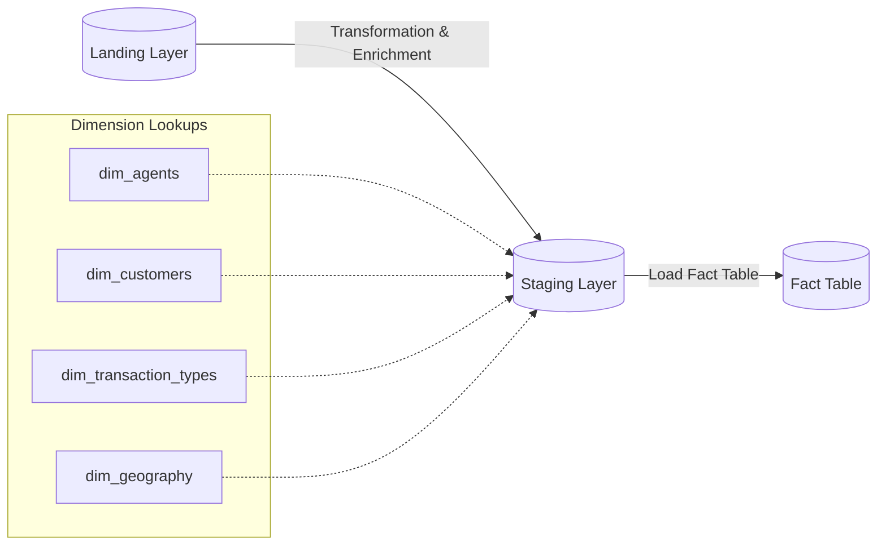

# Agency Banking & Mobile Money Transaction Reconciliation

Welcome to the **Agency Banking & Mobile Money Transaction Reconciliation** project. This project simulates an agency banking and mobile money platform designed to coordinate a nationwide network of independent POS agents processing financial transactions for underbanked populations.

The primary goal of this system is to address operational challenges surrounding daily liquidity tracking, agent commission settlement accuracy, and early identification of high-risk or underperforming nodes within the network.

---

## 📄 Project Documentation

* **Project Plan:** The complete technical specification, schemas, and SQL transformations are detailed in the [AgencyBanking_ProjectPLan.md](./AgencyBanking_ProjectPLan.md) file.
* **Orchestration DAG:** The data generation, simulation, and GCS upload workflow is defined in the [agency_banking_data_generator_dag.py](./dags/agency_banking_data_generator_dag.py) file.

---

## 🏗️ Architecture Overview

The system is implemented using a **Star Schema** database architecture. This design decision denormalizes geographical and agent details to minimize complex multi-stage joins, ensuring fast execution of analytical queries for daily liquidity allocation and agent commission calculations.

### Data Flow Pipeline
The pipeline flows through three logical layers:

1. **Landing Layer (`lnd_agency.lnd_<YYYYMMDD>`)**: Stores raw flat-file logs from agent terminals.
2. **Staging Layer (`stg_agency.stg_<YYYYMMDD>`)**: Standardizes values, performs dimension lookups, filters successful transactions, and computes business metrics (e.g., `agent_commission` calculated as 70% of the transaction fee).
3. **Fact Table (`fact_agency.fact_daily_transactions`)**: The final analytical grain where successful transaction events are stored, answering key operational questions.

---

## 🗄️ Database Schema Summary

### Dimension Tables
* **`dim_agents`**: Identity, terminal hardware mappings, and performance tiers.
* **`dim_customers`**: Customer profiles, account types, and KYC status.
* **`dim_transaction_types`**: Transaction categories (e.g., deposit, withdrawal) and direction.
* **`dim_geography`**: Geographical mapping of terminals (regions, states, LGAs).

### Core Fact Table
* **`fact_daily_transactions`**: Detailed record of each successful transaction. Contains transaction details, location, customer KYC, and pre-calculated commissions.

### Execution Logs
* **`log_db.log_tb`**: Tracks execution start/end timestamps and final statuses for each pipeline execution batch run (e.g., for orchestration with tools like Apache Airflow).

---

## 💡 Key Business Questions Addressed
* Which agent terminals are driving the highest transaction volumes and fee revenue?
* What is the daily total liquidity payout requirement by state or location cluster?
* What are the total daily commissions earned by agents across different performance tiers?
