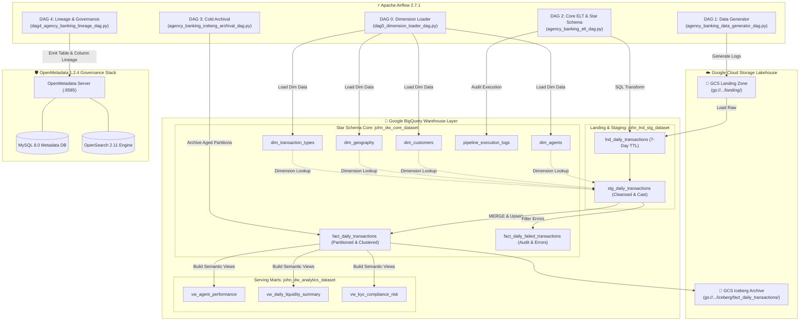
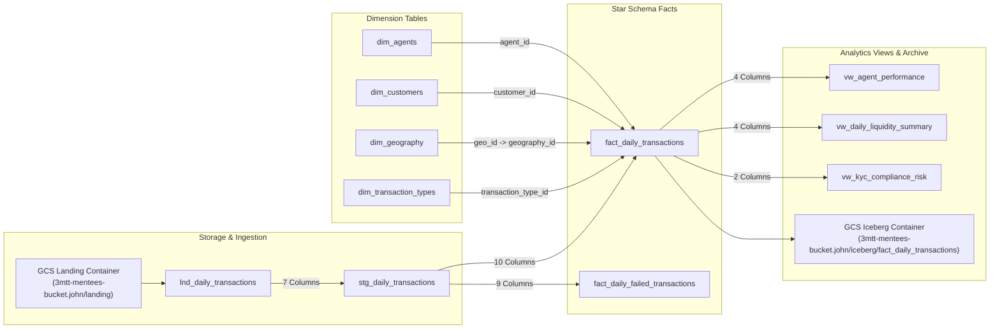

# Agency Banking & Mobile Money Lakehouse Platform

[](https://airflow.apache.org/)
[](https://cloud.google.com/)
[](https://cloud.google.com/bigquery)
[](https://open-metadata.org/)
[](https://iceberg.apache.org/)
[](https://www.docker.com/)

An enterprise-grade **Agency Banking & Mobile Money Lakehouse Data Platform** built to simulate and manage a nationwide network of independent POS agent terminals processing financial transactions (cash-in, cash-out, airtime, bill payments) for underbanked populations.

This system addresses core data engineering and governance requirements around daily liquidity forecasting, agent commission settlement accuracy, operational risk auditing, cold storage compliance archival, and automated data governance cataloging with column-level lineage.

---

## 📚 Project Documentation & Specifications

| Document | Description | Direct Link |
| :--- | :--- | :--- |
| **Engineering Challenges & Solutions** | In-depth technical retrospective detailing every architectural challenge, root cause, and engineering solution across all pipeline and governance components. | [`CHALLENGES_AND_SOLUTIONS.md`](./CHALLENGES_AND_SOLUTIONS.md) |
| **Master Project Plan** | Complete architectural plan, schema designs, Kimball modeling principles, and SQL transformation logic. | [`AgencyBanking_ProjectPLan.md`](./AgencyBanking_ProjectPLan.md) |
| **Project Setup & Operations Guide** | Step-by-step setup guide, prerequisites, operational checklists, and configuration instructions. | [`docs/Project-Guide.md`](./docs/Project-Guide.md) |

---

## 🏛️ End-to-End System Architecture

The platform implements a **Lakehouse Architecture** combining Google Cloud Storage (GCS) raw landing zones, BigQuery ELT transformations, Star Schema dimensional data marts, Apache Iceberg cold archival, and automated OpenMetadata governance orchestration.


```mermaid
graph TD
    subgraph Storage_Layer [☁️ Google Cloud Storage Lakehouse]
        GCS_LND["📁 GCS Landing Zone<br/>(gs://.../landing/)"]
        GCS_ICE["📁 GCS Iceberg Archive<br/>(gs://.../iceberg/fact_daily_transactions/)"]
    end

    subgraph Orchestration [⚡ Apache Airflow 2.7.1]
        DAG0["DAG 0: Dimension Loader<br/>(dag0_dimension_loader_dag.py)"]
        DAG1["DAG 1: Data Generator<br/>(agency_banking_data_generator_dag.py)"]
        DAG2["DAG 2: Core ELT & Star Schema<br/>(agency_banking_elt_dag.py)"]
        DAG3["DAG 3: Cold Archival<br/>(agency_banking_iceberg_archival_dag.py)"]
        DAG4["DAG 4: Lineage & Governance<br/>(dag4_agency_banking_lineage_dag.py)"]
    end

    subgraph BigQuery_DW [🏢 Google BigQuery Warehouse Layer]
        subgraph LND_STG [Landing & Staging: john_lnd_stg_dataset]
            LND_TBL["lnd_daily_transactions (7-Day TTL)"]
            STG_TBL["stg_daily_transactions (Cleansed & Cast)"]
        end
        subgraph CORE_STAR [Star Schema Core: john_dw_core_dataset]
            DIM_A["dim_agents"]
            DIM_C["dim_customers"]
            DIM_G["dim_geography"]
            DIM_T["dim_transaction_types"]
            FACT_TXN["fact_daily_transactions (Partitioned & Clustered)"]
            FACT_FAIL["fact_daily_failed_transactions (Audit & Errors)"]
            LOGS["pipeline_execution_logs"]
        end
        subgraph ANALYTICS [Serving Marts: john_dw_analytics_dataset]
            VW_PERF["vw_agent_performance"]
            VW_LIQ["vw_daily_liquidity_summary"]
            VW_KYC["vw_kyc_compliance_risk"]
        end
    end

    subgraph Governance [🛡️ OpenMetadata 1.2.4 Governance Stack]
        OM_SRV["OpenMetadata Server (:8585)"]
        OM_DB[("MySQL 8.0 Metadata DB")]
        OM_SEARCH[("OpenSearch 2.11 Engine")]
    end

    DAG0 -->|Load Dim Data| DIM_A & DIM_C & DIM_G & DIM_T
    DAG1 -->|Generate Logs| GCS_LND
    GCS_LND -->|Load Raw| LND_TBL
    DAG2 -->|SQL Transform| LND_TBL --> STG_TBL
    DIM_A & DIM_C & DIM_G & DIM_T -.->|Dimension Lookup| STG_TBL
    STG_TBL -->|MERGE & Upsert| FACT_TXN
    STG_TBL -->|Filter Errors| FACT_FAIL
    FACT_TXN -->|Build Semantic Views| VW_PERF & VW_LIQ & VW_KYC
    DAG2 -->|Audit Execution| LOGS
    DAG3 -->|Archive Aged Partitions| FACT_TXN --> GCS_ICE
    DAG4 -->|Emit Table & Column Lineage| OM_SRV
    OM_SRV --- OM_DB
    OM_SRV --- OM_SEARCH
```

---

## 🗄️ Logical Data Pipeline Layers

### 1. Landing Layer (`john_lnd_stg_dataset.lnd_daily_transactions`)
- Ingests raw transaction events emitted by POS terminals directly from GCS storage.
- Preserves raw source formats with a **7-day partition TTL** to minimize active warehouse storage costs.

### 2. Staging Layer (`john_lnd_stg_dataset.stg_daily_transactions`)
- Cleanses string columns, standardizes timestamps (`createdat` $\to$ `transaction_timestamp`, `transaction_date`), and performs dimension surrogate key lookups.
- Stages both `SUCCESS` and `FAILED` transactions without dropping unparsed records.
- Calculates derived financial metrics (e.g., `agent_commission` computed as 70% of the transaction fee for successful operations).

### 3. Star Schema Core Warehouse (`john_dw_core_dataset`)
- **`fact_daily_transactions`**: Partitioned by `transaction_date` and clustered by `(agent_id, geography_id)`. Stores pure, reconciled financial records joined against the 4 dimension tables.
- **`fact_daily_failed_transactions`**: Partitioned by `transaction_date` and clustered by `(agent_id, geography_id)`. Captures incomplete or rejected transactions alongside error codes for compliance and fraud detection.
- **`dim_agents`**: Agent business names, terminal IDs, commission tiers, and onboarding dates.
- **`dim_customers`**: Customer profiles, KYC tier levels (Tier 1, 2, 3), and account statuses.
- **`dim_geography`**: Spatial terminal hierarchy (geo IDs, LGAs, states, regions, zone classifications).
- **`dim_transaction_types`**: Transaction categories (cash-in, cash-out, bill payment, transfer) and fee structures.
- **`pipeline_execution_logs`**: Full audit log capturing execution run IDs, affected row counts, and status timestamps.

### 4. Analytical Serving Data Marts (`john_dw_analytics_dataset`)
- **`vw_agent_performance`**: Aggregates terminal throughput, total revenue generated, and commission payouts by agent.
- **`vw_daily_liquidity_summary`**: Computes net cash-in vs. cash-out liquidity flows to forecast regional cash shortages.
- **`vw_kyc_compliance_risk`**: Flags accounts exceeding daily turnover thresholds relative to their KYC tiers.

---

## 🛡️ Automated Data Governance & Lineage (OpenMetadata)

The platform integrates **OpenMetadata 1.2.4** to provide enterprise cataloging, automated table lineage, and column-level provenance across the entire data lifecycle.


```mermaid
graph LR
    subgraph Sources [Storage & Ingestion]
        GCS_LND_C["GCS Landing Container<br/>(3mtt-mentees-bucket.john/landing)"]
        LND["lnd_daily_transactions"]
        STG["stg_daily_transactions"]
    end

    subgraph Dims [Dimension Tables]
        DIM_A["dim_agents"]
        DIM_C["dim_customers"]
        DIM_G["dim_geography"]
        DIM_T["dim_transaction_types"]
    end

    subgraph Core [Star Schema Facts]
        FACT["fact_daily_transactions"]
        FAIL["fact_daily_failed_transactions"]
    end

    subgraph Serving [Analytics Views & Archive]
        VW_A["vw_agent_performance"]
        VW_L["vw_daily_liquidity_summary"]
        VW_K["vw_kyc_compliance_risk"]
        GCS_ICE_C["GCS Iceberg Container<br/>(3mtt-mentees-bucket.john/iceberg/fact_daily_transactions)"]
    end

    GCS_LND_C --> LND
    LND -->|7 Columns| STG
    STG -->|10 Columns| FACT
    STG -->|9 Columns| FAIL
    DIM_A -->|agent_id| FACT
    DIM_C -->|customer_id| FACT
    DIM_G -->|geo_id -> geography_id| FACT
    DIM_T -->|transaction_type_id| FACT
    FACT -->|4 Columns| VW_A
    FACT -->|4 Columns| VW_L
    FACT -->|2 Columns| VW_K
    FACT --> GCS_ICE_C
```

### Lineage Pipeline Components
- **REST-Native Emitter ([`dags/lineage/lineage_emitter_om.py`](./dags/lineage/lineage_emitter_om.py))**: Lightweight HTTP client compatible with Python 3.8 through 3.12, resolving regex and SDK version conflicts.
- **Declarative Lineage Config ([`dags/lineage/config/agency_banking_lineage_config.json`](./dags/lineage/config/agency_banking_lineage_config.json))**: Centralized JSON mapping file maintaining all 12 lineage edges and column derivations.
- **Automated Catalog Bootstrapping ([`dags/lineage/bootstrap_openmetadata_entities.py`](./dags/lineage/bootstrap_openmetadata_entities.py))**: Programmatically provisions database services, schemas, table definitions, and storage containers.
- **Airflow Connection Auto-Seeding**: The `openmetadata_default` HTTP connection is pre-seeded in `docker-compose.yaml` with a persistent administrative JWT token.

---

## 🗂️ Tracked Repository Structure

```text
3mttc3deprojects/
├── CHALLENGES_AND_SOLUTIONS.md        # Technical retrospective on hurdles and solutions
├── AgencyBanking_ProjectPLan.md       # Master project requirements & specifications
├── docker-compose.yaml                # Multi-container stack (Airflow, OM, MySQL, OpenSearch, Postgres)
├── Dockerfile                         # Custom Airflow container image definition
├── requirements.txt                   # Local & container Python dependencies
├── generate_mock_data.py              # Synthetic transaction & dimension data generator
│
├── dags/                              # Apache Airflow DAG definitions
│   ├── dag0_dimension_loader_dag.py              # DAG 0: Initial Dimension Table Loader
│   ├── agency_banking_data_generator_dag.py      # DAG 1: Daily Landing File Generator
│   ├── agency_banking_elt_dag.py                 # DAG 2: Core BigQuery ELT & Star Schema
│   ├── agency_banking_iceberg_archival_dag.py    # DAG 3: Iceberg / Cold Storage Archival
│   ├── dag4_agency_banking_lineage_dag.py        # DAG 4: OpenMetadata Automated Lineage Emitter
│   └── lineage/
│       ├── __init__.py
│       ├── lineage_emitter_om.py                 # REST-native OpenMetadata client
│       ├── bootstrap_openmetadata_entities.py    # Catalog bootstrap script
│       └── config/
│           └── agency_banking_lineage_config.json # Lineage edge & column mapping config
│
├── sql/                               # BigQuery SQL DDL and ELT Scripts
│   ├── 01_create_datasets_and_tables.sql         # BigQuery schemas, tables, partition/cluster DDL
│   ├── 02_elt_transform_landing_to_staging.sql   # Landing-to-Staging ELT transformation query
│   ├── 03_elt_merge_staging_to_fact.sql          # Staging-to-Fact MERGE upsert query
│   └── 04_create_serving_views.sql               # BI Semantic Serving Views DDL
│
├── governance/                        # Governance & Catalog Configurations
│   └── openmetadata_config.yaml                  # OpenMetadata ingestion configuration
│
├── credentials/                       # Credentials Template Directory (Ignored in Git)
│   └── hmac_credentials.env.template             # HMAC secret key template
│
└── docs/                              # Project Guides
    └── Project-Guide.md                          # Comprehensive project operational guide
```

---

## 🚀 Quick Start & Deployment Guide

### 1. Prerequisites
- [Docker Engine](https://docs.docker.com/engine/install/) (v24.0+) & [Docker Compose](https://docs.docker.com/compose/) (v2.20+)
- 8 GB RAM minimum allocated to Docker
- GCP Service Account JSON key with `BigQuery Admin` and `Storage Admin` roles placed in `credentials/` (mapped via `docker-compose.yaml`)

### 2. Start the Multi-Container Stack
Start all platform containers on the shared `lakehouse_net` network:
```bash
docker compose up -d
```

Verify that all containers are healthy:
```bash
docker compose ps
```

| Service | Port / URL | Credentials |
| :--- | :--- | :--- |
| **Apache Airflow Webserver** | [`http://localhost:8080`](http://localhost:8080) | `airflow` / `airflow` |
| **OpenMetadata Server** | [`http://localhost:8585`](http://localhost:8585) | `admin@openmetadata.org` / `admin` |
| **OpenSearch Engine** | `http://localhost:9200` | N/A (Internal `lakehouse_net`) |
| **MySQL 8.0 Metadata DB** | `localhost:3306` | `openmetadata_user` / `openmetadata_password` |
| **PostgreSQL Airflow DB** | `localhost:5432` | `airflow` / `airflow` |

---

### 3. Pipeline Execution Workflow

Execute the DAGs in sequence via the Airflow UI or CLI:

```bash
# Step 1: Load Dimension Tables (One-Time Setup)
docker exec airflow-webserver airflow dags trigger dag0_dimension_loader_dag

# Step 2: Generate Daily Landing Files in GCS
docker exec airflow-webserver airflow dags trigger agency_banking_data_generator_dag

# Step 3: Run Core ELT & Star Schema Transformation
docker exec airflow-webserver airflow dags trigger agency_banking_elt_dag

# Step 4: Archive Aged Records to GCS Iceberg Cold Storage
docker exec airflow-webserver airflow dags trigger agency_banking_iceberg_archival_dag

# Step 5: Emit Full Table & Column Lineage into OpenMetadata
docker exec airflow-webserver airflow dags trigger dag4_agency_banking_lineage_dag
```

---

### 4. Exploring Lineage in OpenMetadata

1. Open [`http://localhost:8585`](http://localhost:8585) in your web browser.
2. Sign in with `admin@openmetadata.org` / `admin`.
3. Go to **Explore** $\to$ **Tables** $\to$ select **`fact_daily_transactions`**.
4. Click on the **Lineage** tab and switch on **Column Lineage** to explore the complete visual graph across GCS Landing $\to$ Landing Table $\to$ Staging $\to$ Fact $\to$ Analytical Views $\to$ GCS Iceberg Archive.

---

## 👥 Contributors & Maintainers
- **Data Platform Engineering**: John Mamodu guided by Udoh Chigozie
- **Governance & Orchestration**: John Mamodu guided by Udoh Chigozie
- **License**: MIT


