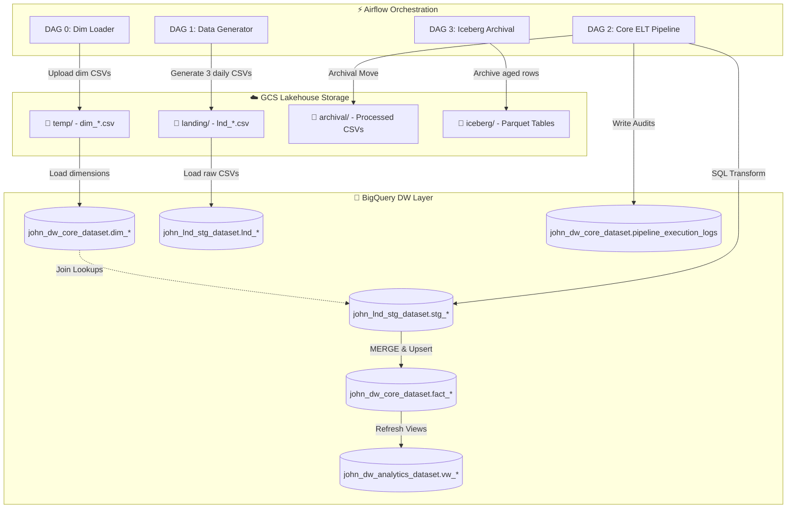

# Agency Banking & Mobile Money Lakehouse Data Pipeline

Welcome to the **Agency Banking & Mobile Money Lakehouse Data Pipeline** project. This project simulates an agency banking and mobile money platform designed to coordinate a nationwide network of independent POS agents processing financial transactions for underbanked populations.

The primary goal of this system is to address operational challenges surrounding daily liquidity tracking, agent commission settlement accuracy, network performance monitoring, and governance compliance auditing.

---

## 📄 Project Documentation

* **Project Plan:** The complete technical specification, schemas, and SQL transformations are detailed in the [`AgencyBanking_ProjectPLan.md`](./AgencyBanking_ProjectPLan.md) file.
* **Project Guide:** The step-by-step setup, requirements checklist, and overview guide can be found in the [`Project-Guide.md`](./docs/Project-Guide.md) file.

---

## 🏗️ Architecture Overview

The system is implemented using a **Lakehouse Architecture** combining local GCS flat file ingestion, BigQuery ELT transformations using SQL, Serving Data Marts, and Apache Iceberg archival, orchestrated by Apache Airflow.

```mermaid
graph TD
    subgraph Orchestration [⚡ Airflow Orchestration]
        DAG0[DAG 0: Dim Loader]
        DAG1[DAG 1: Data Generator]
        DAG2[DAG 2: Core ELT Pipeline]
        DAG3[DAG 3: Iceberg Archival]
    end

    subgraph GCS [☁️ GCS Lakehouse Storage]
        GCS_TMP[📁 temp/ - dim_*.csv]
        GCS_LND[📁 landing/ - lnd_*.csv]
        GCS_ARC[📁 archival/ - Processed CSVs]
        GCS_ICE[📁 iceberg/ - Parquet Tables]
    end

    subgraph BigQuery [🏢 BigQuery DW Layer]
        BQ_DIM[(john_dw_core_dataset.dim_*)]
        BQ_LND[(john_lnd_stg_dataset.lnd_*)]
        BQ_STG[(john_lnd_stg_dataset.stg_*)]
        BQ_FACT[(john_dw_core_dataset.fact_*)]
        BQ_VIEWS[(john_dw_analytics_dataset.vw_*)]
        BQ_LOGS[(john_dw_core_dataset.pipeline_execution_logs)]
    end

    DAG0 -->|Upload dim CSVs| GCS_TMP
    GCS_TMP -->|Load dimensions| BQ_DIM
    
    DAG1 -->|Generate 3 daily CSVs| GCS_LND
    GCS_LND -->|Load raw CSVs| BQ_LND
    
    DAG2 -->|SQL Transform| BQ_STG
    BQ_DIM -.->|Join Lookups| BQ_STG
    BQ_STG -->|MERGE & Upsert| BQ_FACT
    BQ_FACT -->|Refresh Views| BQ_VIEWS
    DAG2 -->|Archival Move| GCS_ARC
    DAG2 -->|Write Audits| BQ_LOGS

    DAG3 -->|Archive aged rows| GCS_ICE
```

### Logical Data Flow Layers
1. **Landing Layer (`john_lnd_stg_dataset.lnd_daily_transactions`)**: Raw ingestion layer loaded directly from GCS transactional logs (`landing/lnd_YYYYMMDD_1..3.csv`).
2. **Staging Layer (`john_lnd_stg_dataset.stg_daily_transactions`)**: Cleans, casts types, performs dimension lookups, stages all transaction events (both `SUCCESS` and `FAILED`), and conditionally computes business metrics (e.g. `agent_commission` calculated as 70% of the transaction fee ONLY for successful transactions).
3. **Core Fact Layer**:
   * **Successful Fact Table (`john_dw_core_dataset.fact_daily_transactions`)**: Partitioned (by transaction date) and clustered (by agent ID and state) data mart storing successful transaction events. Includes `insert_timestamp` and `update_timestamp` tracking.
   * **Failed Fact Table (`john_dw_core_dataset.fact_daily_failed_transactions`)**: Partitioned (by transaction date) and clustered (by agent ID and state) data mart storing failed operational events for reliability analysis. Includes `insert_timestamp` and `update_timestamp` tracking.
4. **Serving Views Layer (`john_dw_analytics_dataset.vw_*`)**: Analytical layer hosting semantic views for business reporting.

---

## 🗄️ Project Repository Map & File Links

### ⚡ Airflow Orchestration DAGs
* **DAG 0: One-Time Dimension Loader** ➔ [`dag0_dimension_loader_dag.py`](./dags/dag0_dimension_loader_dag.py)
* **DAG 1: Daily Landing Data Generator** ➔ [`agency_banking_data_generator_dag.py`](./dags/agency_banking_data_generator_dag.py)
* **DAG 2: Core ELT Pipeline** ➔ [`agency_banking_elt_dag.py`](./dags/agency_banking_elt_dag.py)
* **DAG 3: Monthly Iceberg Archival Pipeline** ➔ [`agency_banking_iceberg_archival_dag.py`](./dags/agency_banking_iceberg_archival_dag.py)

### 📊 SQL Database Scripts (BigQuery DDL & ELT Queries)
* **Dataset & Table DDL Setup:** [`01_create_datasets_and_tables.sql`](./sql/01_create_datasets_and_tables.sql)
* **Staging Transform query:** [`02_elt_transform_landing_to_staging.sql`](./sql/02_elt_transform_landing_to_staging.sql)
* **Fact Merge query:** [`03_elt_merge_staging_to_fact.sql`](./sql/03_elt_merge_staging_to_fact.sql)
* **Serving Views Refresh:** [`04_create_serving_views.sql`](./sql/04_create_serving_views.sql)

### 🛡️ Data Governance & Quality Setup
* **OpenMetadata configuration:** [`openmetadata_config.yaml`](./governance/openmetadata_config.yaml)

### 📦 Containerization & Environment Configuration
* **Docker Compose Orchestration:** [`docker-compose.yaml`](./docker-compose.yaml)
* **Custom Airflow Image Build:** [`Dockerfile`](./Dockerfile)
* **Local Python Dependencies:** [`requirements.txt`](./requirements.txt)

---

## 🗄️ Database Schema Summary

### Dimension Tables (`john_dw_core_dataset`)
All dimension tables contain `insert_timestamp` and `update_timestamp` columns to track ingestion and modifications.
* **`dim_agents`**: POS agent names, business names, tier levels, and terminal hardware mappings.
* **`dim_customers`**: Customer registration profiles, account types, and KYC statuses.
* **`dim_transaction_types`**: Transaction categories (e.g. cash-in, cash-out, airtime) and direction.
* **`dim_geography`**: Geographical mapping of terminals (regions, states, LGAs).

### Core Fact & Logs (`john_dw_core_dataset`)
* **`fact_daily_transactions`**: Partitioned and clustered transaction logs storing successful transaction events, enriched with geographical lookups, derived commissions, and audit timestamps.
* **`fact_daily_failed_transactions`**: Partitioned and clustered logs storing failed operational transactions for error analysis, enriched with metadata and audit timestamps.
* **`pipeline_execution_logs`**: Logs step-by-step metadata (logical dates, rows processed, runtime status) across the entire pipeline.

---

## 💡 Key Business Questions Addressed
* Which agent terminals are driving the highest transaction volumes and fee revenue?
* What is the daily total liquidity payout requirement (cash-in vs cash-out) by state or location cluster?
* What are the total daily commissions earned by agents across different performance tiers?
