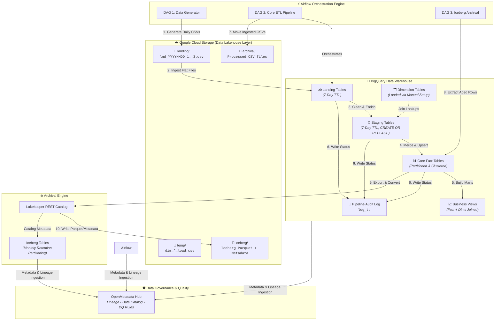
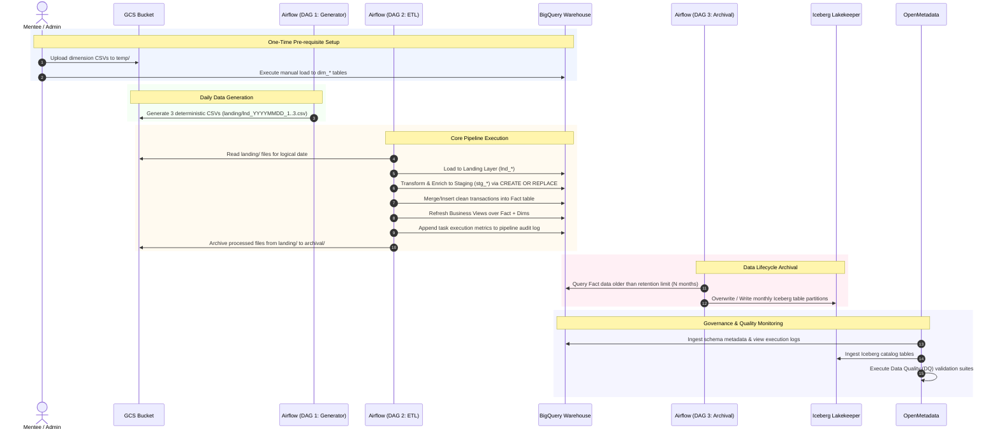
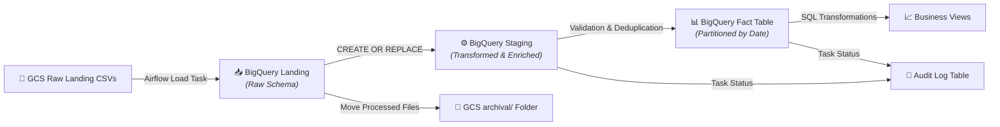
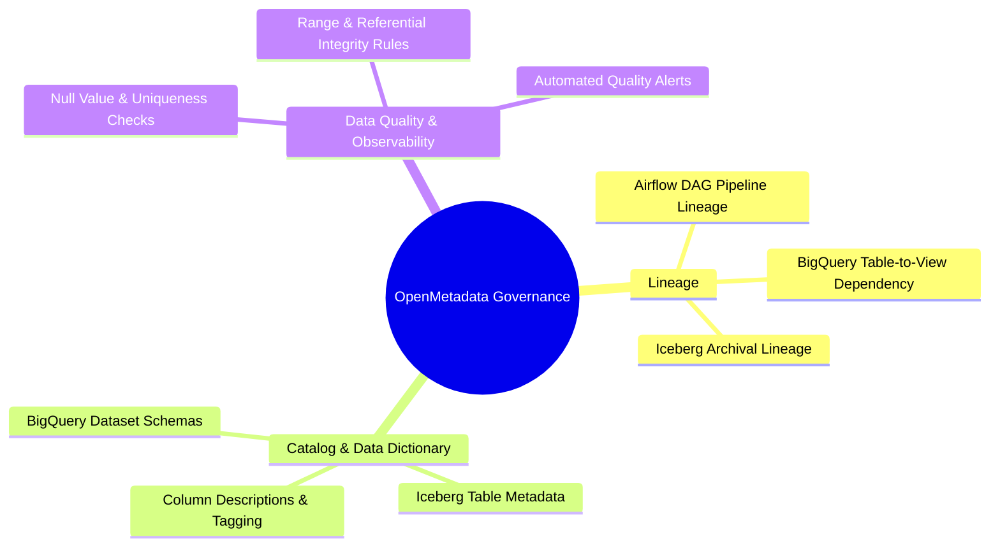

# 3MTT Data Engineering Mentorship: Lakehouse Data Pipeline Guide

> [!IMPORTANT]
> **Project Goal:** Build a governed, end-to-end Lakehouse pipeline using Apache Airflow, Google Cloud Storage (GCS), BigQuery, Apache Iceberg, and OpenMetadata.

---

## 📋 Table of Contents
1. [Project Overview & Config Parameters](#1-project-overview--config-parameters)
2. [End-to-End Architecture](#2-end-to-end-architecture)
3. [Component Breakdown & Workflow](#3-component-breakdown--workflow)
   - [Manual Setup: Dimension Tables](#manual-setup-dimension-tables-one-time)
   - [DAG 1: Data Generator](#dag-1-landing-data-generator-daily)
   - [DAG 2: Core ETL & Data Marts](#dag-2-etl-landing--staging--fact--views)
   - [DAG 3: Iceberg Archival Pipeline](#dag-3-iceberg-archival-pipeline)
4. [Data Governance with OpenMetadata](#4-data-governance-with-openmetadata)
5. [Audit & Logging Specifications](#5-audit--logging-specifications)
6. [Mentee Implementation Checklist](#6-mentee-implementation-checklist)

---

## 1. Project Overview & Config Parameters

### ⚙️ Quick Configuration (Editable Template)
*(Mentees: Customize these variables for your specific business domain project)*

| Parameter | Configuration Value | Description |
| :--- | :--- | :--- |
| **GCP Project ID** | `your-gcp-project-id` | Target Google Cloud Project |
| **GCS Bucket** | `gs://3mtt-lakehouse-[mentee-name]/` | Primary Lakehouse Storage Bucket |
| **BigQuery Dataset (Landing/Staging)**| `lnd_stg_dataset` (7-day TTL) | Temporary ingestion & staging dataset |
| **BigQuery Dataset (Core Fact/Dims)**| `dw_core_dataset` | Permanent warehouse storage |
| **BigQuery Dataset (Serving Views)** | `dw_analytics_dataset` | Business intelligence layer views |
| **Audit Log Table** | `dw_core_dataset.pipeline_execution_logs` | Central execution tracking log |
| **Iceberg REST Catalog** | Lakekeeper REST Endpoint | Archival catalog manager |
| **Governance Platform** | OpenMetadata Instance | Lineage, data dictionary & DQ monitor |

---

## 2. End-to-End Architecture

---

## 3. Component Breakdown & Workflow

---

### Manual Setup: Dimension Tables (One-Time)
- **Purpose:** Dimension tables store slowly changing entity data (e.g., agents, customers, product catalog, geography).
- **Execution Path:**
  1. Upload initial dimension CSV files to `gs://3mtt-lakehouse-[mentee]/temp/`.
  2. Execute one-time DDL and loading scripts into BigQuery dimension tables (`dim_*`).
  3. Verify primary keys and schema integrity before launching automated DAGs.

---

### DAG 1: Landing Data Generator (Daily)
- **Purpose:** Simulates daily operational business activity generating raw transactional data logs.
- **Schedule:** `@daily` (Idempotent execution).
- **Naming Convention:** `landing/lnd_YYYYMMDD_1.csv`, `landing/lnd_YYYYMMDD_2.csv`, `landing/lnd_YYYYMMDD_3.csv`.
- **Idempotency Rule:** Re-running DAG 1 for any historical `logical_date` regenerates the exact same 3 file names, overwriting existing files in GCS without creating duplicate or 4th files.

---

### DAG 2: ELT (Landing ➔ Staging ➔ Fact ➔ Views)
- **Purpose:** Core data processing pipeline transforming raw landing flat files into clean, partitioned fact tables and business intelligence views.

#### Detailed Execution Steps:
1. **Load Landing:** Read `landing/` CSVs corresponding to `logical_date` into BigQuery landing table.
2. **Transform to Staging:** Run `CREATE OR REPLACE TABLE` logic to build staging. The `CREATE OR REPLACE` pattern ensures task retries self-heal without side effects.
3. **Merge into Partitioned Fact:** Perform `MERGE` or `INSERT` into partitioned `fact_*` table. Route invalid/corrupted records to an optional `reject_*` table.
4. **Audit Logging:** Append run summary (status, timestamp, row counts, execution time) into `log_tb` for every task step.
5. **Refresh Serving Views:** Re-create or refresh analytical business SQL views joining Fact and Dimension tables.
6. **File Hygiene & Archival:** Automatically move processed landing CSV files from `landing/` to `archival/` upon successful DAG execution. Note: Landing & Staging datasets feature a 7-day auto-expiration (TTL).

---

### DAG 3: Iceberg Archival Pipeline
- **Purpose:** Offload historical fact data from BigQuery to Apache Iceberg format to optimize storage cost while preserving query accessibility via open formats.
- **Engine & Catalog:** BigQuery execution engine integrated with **Lakekeeper REST Catalog**.
- **Retention Strategy:** Filter fact table for records exceeding retention period (e.g., `transaction_date < DATE_SUB(CURRENT_DATE(), INTERVAL N MONTH)`).
- **Idempotency Rule:** Write operations overwrite target monthly Iceberg partitions (`DELETE` + `INSERT` or overwrite partition), preventing duplicated records on re-runs.

---

## 4. Data Governance with OpenMetadata

OpenMetadata acts as the central data governance, cataloging, and quality framework across the lakehouse.

### Governance Deliverables:
1. **End-to-End Lineage:** Full visual mapping from raw GCS CSV files -> Airflow DAG Tasks -> BigQuery Landing/Staging/Fact -> Business Views & Iceberg Archives.
2. **Unified Data Catalog:** Tagged schemas, column descriptions, and metadata for both BigQuery tables and Iceberg open table formats.
3. **Data Quality (DQ) Suites:** Domain-specific DQ rules executed on fact/staging layers (e.g., `amount > 0`, non-null foreign keys, unique transaction IDs).

---

## 5. Audit & Logging Specifications

Every pipeline execution step must append audit events to `dw_core_dataset.pipeline_execution_logs`:

| Column Name | Data Type | Description |
| :--- | :--- | :--- |
| `run_id` | `STRING` | Airflow DAG run execution ID |
| `logical_date` | `DATE` | Pipeline logical date timestamp |
| `task_id` | `STRING` | Name of the executed Airflow task |
| `target_table` | `STRING` | Name of modified dataset/table |
| `rows_processed` | `INT64` | Number of inserted / modified rows |
| `execution_status` | `STRING` | `SUCCESS` \| `FAILED` \| `RETRY` |
| `created_at` | `TIMESTAMP` | Event logging timestamp |

---

## 6. Mentee Implementation Checklist

Use this checklist to track your project implementation progress:

- [ ] **Phase 1: Environment & Schema Setup**
  - [ ] Provision GCS Bucket with `landing/`, `temp/`, `archival/`, and `iceberg/` folders.
  - [ ] Upload dimension CSVs to `temp/` and complete manual load into BigQuery `dim_*` tables.
  - [ ] Create audit log table `dw_core_dataset.pipeline_execution_logs`.

- [ ] **Phase 2: Airflow DAG Development**
  - [ ] Implement **DAG 1 (Data Generator)**: Ensure daily 3-file output with deterministic `lnd_YYYYMMDD_1..3.csv` naming.
  - [ ] Implement **DAG 2 (Core ETL)**: Load raw data, build staging via `CREATE OR REPLACE`, merge into partitioned fact, log audit events, refresh views, move CSVs to `archival/`.
  - [ ] Implement **DAG 3 (Iceberg Archival)**: Offload historical records older than $N$ months to Apache Iceberg using Lakekeeper REST Catalog.

- [ ] **Phase 3: Governance & Verification**
  - [ ] Connect OpenMetadata to BigQuery, Iceberg, and Airflow.
  - [ ] Validate visual end-to-end lineage graph.
  - [ ] Define and run domain Data Quality (DQ) tests.
  - [ ] Perform backfill & re-run testing to verify complete pipeline idempotency.
